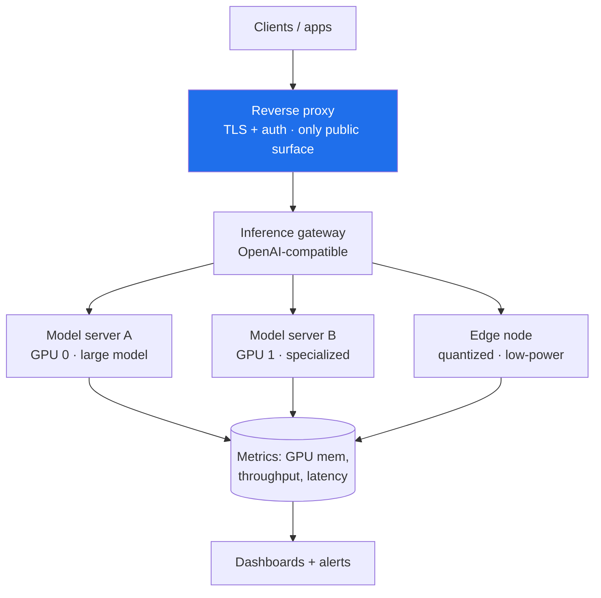

# Architecture & Case Study — On-Prem GPU Inference Infrastructure

> How I run production-grade AI inference on owned hardware instead of renting
> it. Infrastructure patterns only — no real hostnames, IPs, keys, model names,
> or topology of any private deployment.

## 1. Context & problem

Cloud inference is the right call until it isn't. At sustained volume, or with
private data, or when sub-second latency matters, renting GPUs by the token
becomes the wrong trade:

- **Cost** scales linearly with usage — high-volume workloads bleed money.
- **Privacy** means your data crosses someone else's network on every request.
- **Latency** carries a round-trip you can't optimize away.
- **Control** over model versions and uptime sits with the provider.

The answer is a small, well-run on-prem rig that a serious platform can sit on:
private, low-latency, reproducible, and hardened like production — because it
*is* production.

## 2. Topology

**The rule that shapes everything:** model servers bind to loopback and are
reachable *only* through the gateway; the reverse proxy is the single public
surface, and it terminates TLS and authenticates every request.

## 3. Layout

| Path | Purpose |
|------|---------|
| `compose/inference.yaml` | Model servers + gateway, GPU-pinned, loopback-bound |
| `compose/monitoring.yaml` | Prometheus + Grafana + GPU exporter |
| `provisioning/setup.sh` | Host setup: GPU driver, container runtime, hardening baseline |
| `monitoring/` | Scrape config for GPU/throughput/latency |
| `docs/hardening.md` | The security baseline (treated as production) |

## 4. Key design decisions

| # | Decision | Why |
|---|----------|-----|
| 1 | **One authenticated gateway in front of every model** | No model server is exposed directly; all traffic is authenticated and observable at one seam. |
| 2 | **Loopback-bind model servers; TLS only at the edge** | Internal hops stay on a trusted bridge; the only internet-facing port is the proxy's TLS. |
| 3 | **GPU pinning per model server** | Each server reserves a specific GPU, so capacity is predictable and one workload can't starve another. |
| 4 | **Infra-as-code, pinned images** | The whole rig comes up from `compose` + a provisioning script; pinned tags make deploys reproducible and reviewable. |
| 5 | **Monitor like production** | GPU memory, throughput, and request latency are dashboards + alerts from day one — capacity problems are visible before they page. |

Full decision records: [`docs/adr/`](docs/adr/).

## 5. Trade-offs

- **CapEx vs. OpEx** — buying GPUs is upfront cost and you own the uptime; it
  pays off at sustained volume and buys privacy/latency that rent can't.
- **Capacity ceiling** — owned hardware has a fixed ceiling; the gateway can
  spill to a cloud tier (see the inference-router project) when local is
  exhausted, giving on-prem economics with cloud elasticity at the margin.
- **Ops burden** — you run the drivers, the containers, the monitoring. The
  hardening baseline and IaC are what keep that burden bounded.

## 6. Outcomes (architectural properties achieved)

- **Data never leaves the network** for on-prem-served requests — privacy by
  construction, not by policy.
- **Sub-second local responses** for resident models, no cloud round-trip.
- **Reproducible deploys** — the rig is described in code, not in someone's head.
- **No model server is internet-reachable** — the attack surface is one
  authenticated, TLS-terminated gateway.

## 7. Where this came from

Distilled from running real multi-GPU inference hardware with cloud fallback at
the margin. The specific hosts, addresses, and models stay private; the way the
infrastructure is *shaped and hardened* is the shareable part.
