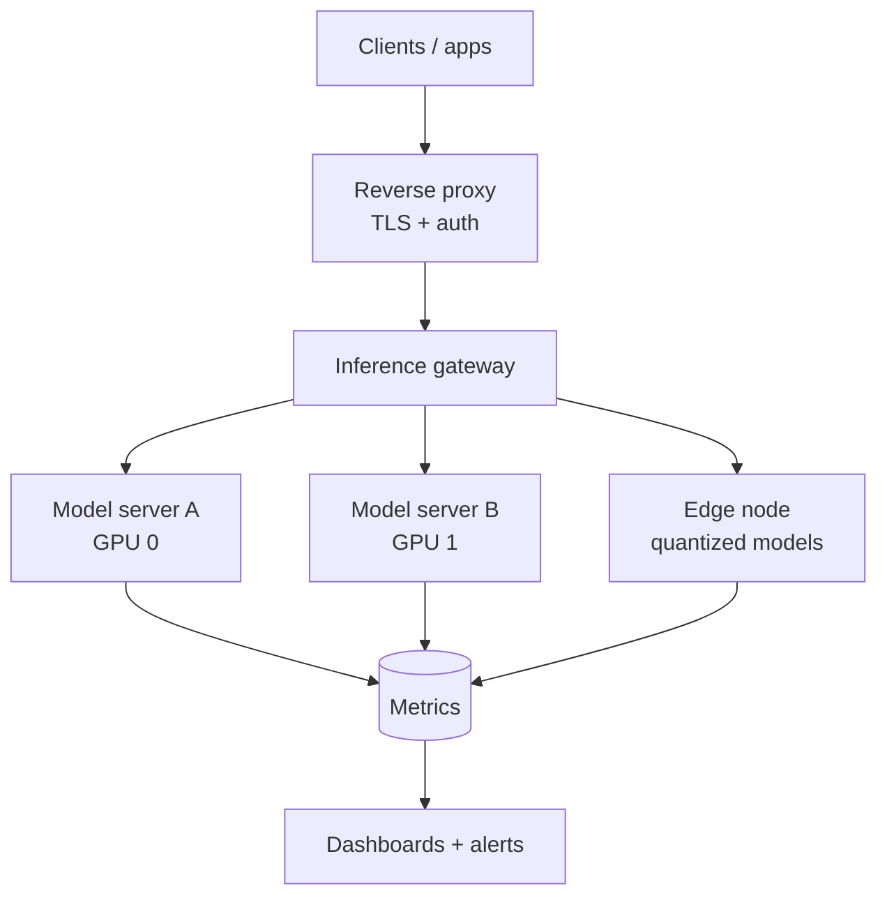

# 🖥️ homelab-ai-infra

> Infrastructure-as-code and operational docs for a **self-hosted, on-prem GPU inference rig** — private model serving, monitoring, and reproducible deployment on real hardware.

This repo documents how I run **production-grade AI inference on my own iron** instead of renting it. It's the foundation a serious AI platform sits on: low-latency, private, and fully under your control. Shareable because it's *how* I run infrastructure — the models and data that run on it stay private.

---

## The rig

| Component | Role |
|-----------|------|
| Workstation-class host (dual-GPU) | Primary inference — large local models |
| Edge compute node | Low-power on-site / airborne inference |
| Containerized model servers | OpenAI-compatible serving behind one gateway |
| Reverse proxy + TLS | Single secure entry point |
| Monitoring stack | GPU utilization, latency, and health dashboards |

## Topology



## What's in here

- **`compose/`** — Docker Compose stacks for model servers, gateway, and monitoring
- **`provisioning/`** — host setup: GPU drivers, container runtime, hardening baseline
- **`monitoring/`** — dashboards for GPU memory, throughput, and request latency
- **`docs/`** — capacity planning, quantization trade-offs, and a runbook for common failures

## Why on-prem?

| Concern | On-prem answer |
|---------|----------------|
| **Privacy** | Data never leaves your network |
| **Cost** | No per-token cloud bill on high-volume workloads |
| **Latency** | Sub-second local responses |
| **Control** | Your models, your versions, your uptime |

## Quick start

```bash
git clone https://github.com/tsmith-surgexi/homelab-ai-infra.git
cd homelab-ai-infra
# 1. Provision the host (drivers, runtime, hardening)
sudo ./provisioning/setup.sh
# 2. Bring up the inference + monitoring stack
docker compose -f compose/inference.yaml up -d
docker compose -f compose/monitoring.yaml up -d
```

## Hardening baseline

Even a homelab gets treated like production: least-privilege service accounts, no model server exposed directly to the internet, TLS at the edge, and a single authenticated gateway in front of every model. Full notes in [`docs/hardening.md`](docs/hardening.md).

## Roadmap

- [ ] Automated model warm-up + readiness gating
- [ ] GPU autoscaling across additional nodes
- [ ] Backup/restore for vector stores and configs

## Architecture & case study

For the full write-up — problem framing, architecture diagrams, sequence
flows, design-decision records (ADRs), and trade-offs — see
**[ARCHITECTURE.md](ARCHITECTURE.md)** and the [ADRs](docs/adr/).

## License

MIT — see [LICENSE](LICENSE).
